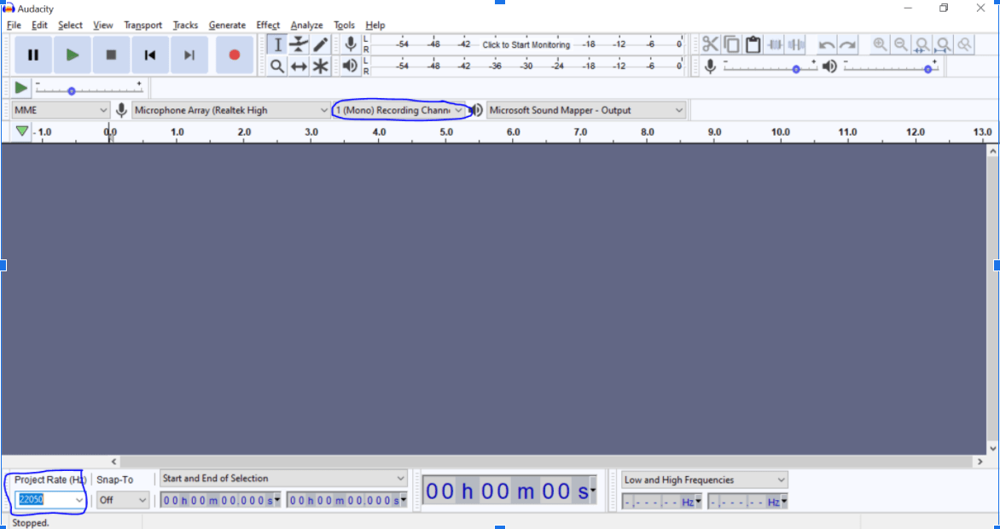

# Thai Text To Speech Documentation on creating dataset for voice cloning

### Software requirement: download any of the 3
- Audacity: https://www.audacityteam.org/
- Windows Audio Recorder
- Or Bandlab: https://www.bandlab.com/'

    
    *note: Bandlab is an android / apple app.
    
---
#### Guide:
* Try to record in a quiet place to reduce the background white noises and double check the microphone if it creates noises. 
* There are 150-200 sentences to be recorded. 
* The wav file must be saved on “MONO” and the sampling rate should be 22050. 
* Be careful when naming the wav files, the wav file name must be: Audio_1.wav - Audio_2.wav same number on the dataset.txt, 
* And lastly try to record with one person only to make the model replicate the voice accurately.

---
#### Download: dataset.txt 
This contain 150 - 200 sentences for the dataset

---
After finishing recording the dataset proceed to this colab file for training and demo.
**TacotronTraining.ipynb**

---
#### Method 1: 
Audacity. This one is complicated to use but the wav file is already processed.

Check and Switch the recording channel to Stereo -> Mono. And also check the Project Rate (Hz) switch to 	22050.

After recording, check the details of the audio and then export it (wav file: Audio_1.wav).

---
#### Method 2: 
Window Audio Recorder. This is the easiest way to record the datasets.

Rename the file to Audio_#.wav as soon as it's done to reduce the confusion on finding the wav file.

---
#### Method 3: 
Bandlab. This is also complicated but the result is good but the data must be processed on the colab and the file is automatically transferred to gdrive.

After recording a sentence the “option” and download the file.

Select Save to Drive and rename the file to Audio_1.wav change the extension m4a to wav. After saving, remove the track or undo the track.